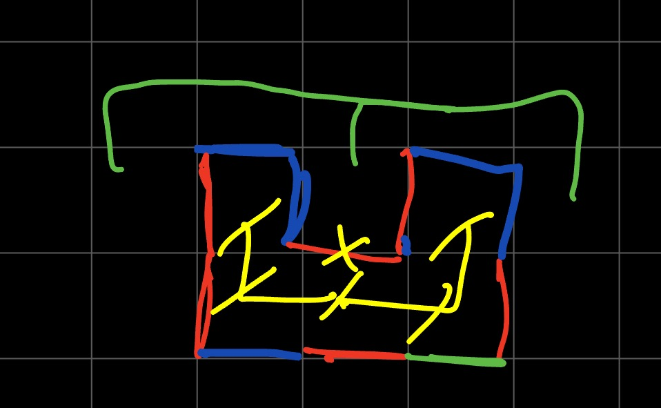

# Algorytm aktualizacji stanu gry
---

### Struktury danych
Stan gry będzie reprezentowany przez graf rzadki, gdzie kreski rysowane przez graczy są reprezentowane przez krawędzie grafu sąsiadujących wierzchołków. Algorytm aktualizacji będzie trawersował graf gdzie krawędzie są ogranicze przez kreski graczy.

(Biały - system koordynatów krawędzi graczy, żółty - system koordynatów trawersowania algorytmu)

Algorytm wykorzystwany do detekcji stanów będzie wykorzystywał dwa algorytmy A* puszczane jednocześnie po dwóch stronach krawędzi narysowanej przez gracza

(Niebieski/czerwony - ruchy graczy, biały x - ostatni ruch, czerwone kropki - starty algorytmów A*)

Celem A* jest dojście do drugiego startu. Jeśli algorytmy się spotkają (mają wspólną przestrzeń odwiedzeń), to wiemy, że figura jest otwarta:

(niebieski/czerwony - ruchy graczy, zielony/żółty x - ostatni ruch, zielony/żółty - ruchy A*, różowy X - spotkanie algorytmów)

W przypadku gdy trawersy się nie spotkają, a jeden z nich obejdzie wszystkie pola wiemy, że figura jest zamknięta.


(niebieski/czerwony - ruchy graczy, zielony/zółty - trawersy algorytmów)

W tym momencie obszar jest zaznaczony przez algorytm który pierwszy zakończył

---

## Opis algorytmu
```python
def check_state(board, last_stroke):
	S = new_astar_states()
	first = initialize_astar(last_stroke.left_side)
	second = initialize_astar(last_stroke.right_side)
	current = first
	while True:
		status = current.perform_move()
		if status == found_other_algorithm:
			return OPEN
		if status == no_more_moves:
			return CLOSED, get_area(current)

		if current == first:
			current = second
		else:
			current = first
```

